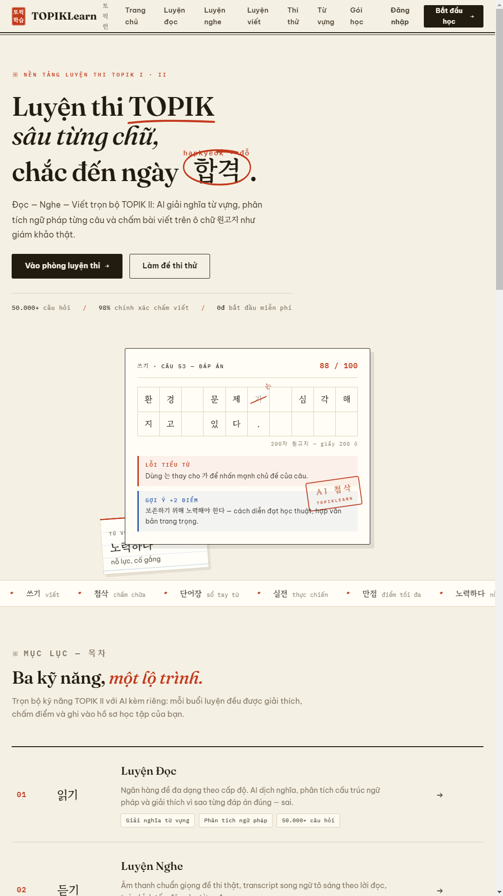

Phân tích luồng nghiệp vụ khép kín cho Agent tuyển dụng HR

Hệ thống gồm ba tác nhân chính:

Ứng viên: xem việc, nộp CV, nhận phản hồi, cải thiện CV, tham gia phỏng vấn.
HR: đăng tuyển, xác nhận tiêu chí, kiểm duyệt kết quả Agent, phỏng vấn và ra quyết định.
Agent: phân tích JD/CV, chấm điểm có bằng chứng, phân luồng hồ sơ, tạo phản hồi, lên lịch và hỗ trợ phỏng vấn.

Nguyên tắc quan trọng:

Agent hỗ trợ đánh giá và đề xuất; HR giữ quyền quyết định shortlist, từ chối, phỏng vấn và tuyển dụng cuối cùng.

1. Luồng tổng thể
   HR tạo Job
   ↓
   Agent phân tích JD và tạo Rubric
   ↓
   HR kiểm tra, chỉnh sửa và duyệt Rubric
   ↓
   Đăng tuyển
   ↓
   Ứng viên đọc Job và nộp CV
   ↓
   CV vào hàng đợi xử lý
   ↓
   Agent đọc, chuẩn hóa và phân tích CV
   ↓
   Agent đối chiếu CV với Job
   ↓
   Chấm điểm + trích dẫn bằng chứng + phát hiện điểm thiếu
   ↓
   HR kiểm tra kết quả
   ├─ Không phù hợp
   │      ↓
   │  Gửi phản hồi cải thiện CV cho ứng viên
   │
   ├─ Cần bổ sung thông tin
   │      ↓
   │  Yêu cầu ứng viên cập nhật CV hoặc trả lời câu hỏi
   │
   └─ Ứng viên tiềm năng
   ↓
   HR duyệt shortlist
   ↓
   Agent gửi thông báo đỗ vòng CV
   ↓
   Agent hỗ trợ đặt lịch phỏng vấn
   ↓
   Agent tạo bộ câu hỏi theo JD và CV
   ↓
   HR thực hiện phỏng vấn và chấm điểm
   ↓
   Agent tổng hợp kết quả
   ↓
   HR quyết định tuyển / dự phòng / từ chối
   ↓
   Gửi kết quả và kết thúc quy trình
2. Giai đoạn HR tạo và đăng tuyển
   2.1 HR nhập thông tin công việc

HR cung cấp:

Tên vị trí.
Mô tả công việc.
Cấp bậc.
Kỹ năng bắt buộc.
Kỹ năng ưu tiên.
Số năm kinh nghiệm.
Địa điểm và hình thức làm việc.
Mức lương nếu được công khai.
Quy trình phỏng vấn.
Hạn nộp hồ sơ.
Số lượng cần tuyển.
2.2 Agent phân tích Job Description

Agent thực hiện:

Tách yêu cầu bắt buộc và yêu cầu ưu tiên.
Chuẩn hóa tên kỹ năng.
Phát hiện các tiêu chí mơ hồ.
Phát hiện yêu cầu không liên quan trực tiếp tới công việc.
Tạo rubric chấm CV.
Đề xuất câu hỏi sàng lọc ban đầu.
Đề xuất cấu trúc phỏng vấn.

Ví dụ Agent phát hiện JD có nội dung:

“Có tư duy tốt, chịu áp lực cao, giao tiếp tốt.”

Agent cần yêu cầu HR chuyển thành tiêu chí đo được:

Có kinh nghiệm làm việc trực tiếp với khách hàng.
Có kinh nghiệm xử lý nhiều nhiệm vụ cùng lúc.
Có ví dụ giải quyết xung đột hoặc sự cố.
Có khả năng trình bày giải pháp kỹ thuật cho người không chuyên.
2.3 HR duyệt rubric trước khi đăng

Agent không tự đặt trọng số rồi dùng ngay. HR phải xác nhận:

Tiêu chí	Loại	Trọng số
Kỹ năng chuyên môn chính	Bắt buộc	30%
Kinh nghiệm liên quan	Chấm điểm	20%
Dự án thực tế	Chấm điểm	15%
Thành tích đo lường được	Chấm điểm	10%
Kỹ năng hỗ trợ	Ưu tiên	10%
Ngoại ngữ	Theo yêu cầu Job	5%
Mức độ rõ ràng của bằng chứng	Chấm điểm	10%

Sau khi HR duyệt, Job chuyển trạng thái:

DRAFT → RUBRIC_REVIEW → APPROVED → PUBLISHED
3. Luồng người dùng đọc Job và nộp CV
3.1 Người dùng xem Job

Trang Job cần hiển thị rõ:

Trách nhiệm chính.
Kỹ năng bắt buộc.
Kỹ năng được ưu tiên.
Hình thức làm việc.
Quy trình tuyển dụng.
Các vòng phỏng vấn.
Thời gian dự kiến phản hồi.

Agent có thể hỗ trợ ứng viên hỏi:

“Tôi có phù hợp với vị trí này không?”
“Kỹ năng nào là bắt buộc?”
“Vị trí này có phù hợp với fresher không?”
“CV của tôi còn thiếu nội dung nào trước khi nộp?”

Ở bước này, Agent chỉ đưa ra tư vấn sơ bộ, không cam kết ứng viên sẽ được tuyển.

3.2 Người dùng nộp CV

Dữ liệu đầu vào có thể gồm:

CV PDF hoặc Word.
Portfolio.
GitHub hoặc website cá nhân.
Câu trả lời sàng lọc.
Thông tin liên hệ.
Thời gian có thể bắt đầu.
Mong muốn làm việc.

Sau khi nộp:

SUBMITTED → QUEUED

Ứng viên nhận thông báo:

“Hồ sơ của bạn đã được tiếp nhận và đang chờ phân tích.”

4. Hàng đợi xử lý CV

Hàng đợi giúp xử lý nhiều hồ sơ mà không gây nghẽn hệ thống.

Mỗi CV cần có:

candidate_id
job_id
application_id
submitted_at
processing_status
parser_confidence
matching_score
review_status
Thứ tự ưu tiên hàng đợi

Có thể ưu tiên theo:

Hồ sơ nộp trước.
Job sắp hết hạn.
Vị trí cần tuyển gấp.
Hồ sơ bị lỗi cần xử lý lại.
Hồ sơ được HR yêu cầu phân tích lại.

Không nên ưu tiên dựa trên tên, giới tính, tuổi, ảnh hoặc các thuộc tính cá nhân không liên quan đến công việc.

5. Agent tự động phân tích CV
   5.1 Kiểm tra chất lượng file

Agent kiểm tra:

File có mở được không.
CV có phải đúng loại tài liệu không.
Nội dung có đọc được không.
OCR có đủ chính xác không.
Có thiếu trang hay không.
CV có mật khẩu hay bị lỗi không.

Routing:

Đọc được tốt
→ Chuyển sang phân tích

Đọc được nhưng độ tin cậy thấp
→ Chuyển HR hoặc yêu cầu ứng viên tải lại

Không đọc được
→ Thông báo ứng viên tải file khác
5.2 Trích xuất thông tin

Agent trích xuất:

Họ tên và thông tin liên hệ.
Kinh nghiệm làm việc.
Chức danh.
Thời gian làm việc.
Kỹ năng.
Dự án.
Thành tích.
Học vấn.
Chứng chỉ.
Ngoại ngữ.
Portfolio và đường dẫn liên quan.

Agent phải phân biệt:

Có nhắc tới kỹ năng.
Có sử dụng kỹ năng trong dự án.
Có kinh nghiệm thực tế.
Có kết quả đo lường được.

Ví dụ:

“Biết Python”
→ Bằng chứng yếu

“Xây dựng API bằng Python/FastAPI cho hệ thống 20.000 người dùng”
→ Bằng chứng mạnh
5.3 Chuẩn hóa dữ liệu

Agent chuẩn hóa:

ReactJS → React.
Node → Node.js.
GCP → Google Cloud Platform.
Business Development Executive → Nhân viên phát triển kinh doanh.
06/2023–Hiện tại → số tháng kinh nghiệm.

Agent cũng cần phát hiện:

Thời gian công việc bị chồng lấn.
Kỹ năng không có bằng chứng.
Số năm kinh nghiệm khai báo không khớp timeline.
Nội dung bị lặp hoặc nhồi từ khóa.
6. Logic đối chiếu Job và CV

Nên đánh giá theo hai lớp.

Lớp 1: Kiểm tra điều kiện công việc

Ví dụ:

Có chứng chỉ bắt buộc không?
Có kỹ năng cốt lõi không?
Có thể làm đúng địa điểm hoặc ca làm việc không?
Có đáp ứng điều kiện pháp lý cần thiết không?

Khi không đáp ứng, Agent chỉ nên gắn cờ:

MANDATORY_CRITERION_NOT_FOUND

HR kiểm tra trước khi quyết định.

Không nên tự động loại vì:

Tuổi.
Giới tính.
Hình ảnh.
Tình trạng hôn nhân.
Khoảng trống nghề nghiệp.
Trường học không nổi tiếng.
Tên công ty cũ không quen thuộc.
Lớp 2: Chấm mức độ phù hợp

Một rubric tham khảo:

Nhóm	Điểm tối đa
Kỹ năng bắt buộc	30
Kinh nghiệm liên quan	20
Dự án và phạm vi công việc	15
Thành tích có số liệu	10
Kỹ năng ưu tiên	10
Cấp độ trách nhiệm	10
Chất lượng bằng chứng	5
Tổng	100

Mỗi tiêu chí cần có:

Điểm.
Bằng chứng trong CV.
Nội dung còn thiếu.
Mức độ tin cậy.
Giải thích ngắn.

Ví dụ:

Tiêu chí: React
Điểm: 4/5
Bằng chứng:

- 2 năm xây dựng giao diện bằng React.
- Tham gia phát triển hệ thống thương mại điện tử.

Điểm thiếu:

- Chưa tìm thấy bằng chứng về tối ưu hiệu năng React.

Độ tin cậy: 91%
7. Routing hồ sơ sau khi Agent chấm

Không nên chỉ dùng một điểm tổng. Cần kết hợp:

Điểm phù hợp

+ Điều kiện bắt buộc
+ Độ tin cậy
+ Dữ liệu thiếu
+ Rủi ro parser
  Routing đề xuất
  Điều kiện	Kết quả routing
  Điểm cao, dữ liệu rõ, không thiếu tiêu chí chính	Đề xuất shortlist
  Điểm trung bình nhưng có kỹ năng chuyển đổi	HR đánh giá sâu
  Thiếu dữ liệu quan trọng	Yêu cầu ứng viên bổ sung
  Điểm thấp nhưng Agent không chắc chắn	HR kiểm tra
  File CV đọc lỗi	Yêu cầu tải lại hoặc xử lý thủ công
  Không thấy điều kiện bắt buộc	Gắn cờ để HR xác nhận
  Có dấu hiệu CV chứa nội dung bất thường	Human review

Ví dụ ngưỡng ban đầu:

80–100: SHORTLIST_RECOMMENDED
60–79: HUMAN_REVIEW
40–59: NEED_MORE_EVIDENCE
0–39: LOW_MATCH_REVIEW

Không nên dùng trạng thái AUTO_REJECT trong MVP.

8. HR kiểm tra và duyệt CV

HR nhìn thấy một màn hình gồm:

CV gốc.
Tóm tắt ứng viên.
Điểm theo rubric.
Bằng chứng được highlight.
Tiêu chí còn thiếu.
Cảnh báo của Agent.
Mức độ tin cậy.
Đề xuất routing.

HR có thể:

Duyệt vào vòng phỏng vấn
Yêu cầu bổ sung thông tin
Đưa vào talent pool
Không tiếp tục
Chuyển cho quản lý chuyên môn
Yêu cầu Agent phân tích lại

Mỗi thay đổi của HR cần được lưu:

Điểm Agent
Điểm HR
Quyết định HR
Lý do thay đổi
Người thực hiện
Thời gian

Dữ liệu này rất quan trọng để đánh giá và cải thiện Agent.

9. Phản hồi cho ứng viên chưa đạt

Sau khi HR xác nhận không tiếp tục hoặc yêu cầu cải thiện, Agent tạo phản hồi.

Phản hồi nên gồm
Điểm đã đáp ứng

“Bạn đã thể hiện kinh nghiệm với Java và Spring Boot qua hai dự án.”

Điểm còn thiếu so với Job

“Hồ sơ chưa thể hiện rõ kinh nghiệm thiết kế API, kiểm thử tự động và triển khai hệ thống.”

Cách cải thiện CV

“Hãy bổ sung vai trò cụ thể trong dự án, công nghệ sử dụng, quy mô hệ thống và kết quả đạt được.”

Ví dụ chỉnh sửa

Trước:

“Tham gia dự án thương mại điện tử.”

Sau:

“Phát triển ba REST API bằng Spring Boot cho module đơn hàng; viết unit test và giảm 20% lỗi sau phát hành.”

Những nội dung không nên gửi
Điểm xếp hạng so với ứng viên khác.
Nhận xét về ngoại hình hoặc đặc điểm cá nhân.
Suy đoán tính cách từ CV.
Khẳng định ứng viên “không có năng lực”.
Lý do chưa được HR xác nhận.
Tiêu chí nội bộ bí mật.

Trạng thái:

HR_REJECTED
→ FEEDBACK_GENERATED
→ HR_APPROVED_FEEDBACK
→ FEEDBACK_SENT

Agent không nên tự gửi phản hồi tiêu cực trước khi HR duyệt.

10. Luồng ứng viên tiềm năng

Khi HR duyệt:

HR_REVIEWED → SHORTLISTED

Agent thực hiện:

Tạo thông báo đỗ vòng CV.
Đưa ra các khung giờ phỏng vấn.
Kiểm tra lịch của HR.
Cho ứng viên chọn lịch.
Tạo sự kiện lịch.
Gửi xác nhận.
Nhắc lịch trước buổi phỏng vấn.
Cung cấp hướng dẫn tham dự.

Nội dung thông báo:

Tên Job.
Vòng phỏng vấn.
Hình thức online/offline.
Thời lượng.
Người tham gia.
Nội dung cần chuẩn bị.
Đường dẫn cuộc họp.
Cách đổi lịch.
11. Agent tạo câu hỏi phỏng vấn

Câu hỏi phải dựa trên ba nguồn:

Job Description

+ Rubric đã được HR duyệt
+ Bằng chứng và khoảng trống trong CV
  Cấu trúc từ cơ bản đến nâng cao
  Mức 1 — Xác minh thông tin CV
  Bạn có thể mô tả vai trò của mình trong dự án X?
  Bạn trực tiếp thực hiện phần nào?
  Dự án có bao nhiêu thành viên?
  Bạn sử dụng công nghệ này trong bao lâu?

Mục tiêu: xác định thông tin trong CV có chính xác hay không.

Mức 2 — Kiến thức cơ bản

Ví dụ Backend:

REST API là gì?
Phân biệt authentication và authorization.
Khi nào nên dùng SQL và NoSQL?
Unit test giúp giải quyết vấn đề gì?
Mức 3 — Áp dụng thực tế
Bạn sẽ thiết kế API đăng nhập như thế nào?
Làm sao xử lý khi một API phản hồi chậm?
Bạn tổ chức logging và error handling thế nào?
Hãy mô tả cách bạn triển khai một tính năng từ yêu cầu đến production.
Mức 4 — Tình huống nâng cao
Hệ thống có một triệu request mỗi ngày, bạn sẽ tối ưu ở đâu?
Làm sao xử lý dữ liệu không nhất quán giữa các service?
Bạn thiết kế cơ chế retry mà không tạo dữ liệu trùng như thế nào?
Khi production gặp lỗi nghiêm trọng, quy trình phản ứng của bạn là gì?
Mức 5 — Câu hỏi theo khoảng trống trong CV

Nếu CV ghi Java nhưng chưa có bằng chứng về testing:

“Trong dự án gần nhất, bạn đã kiểm thử service Java như thế nào?”

Nếu CV ghi quản lý đội nhóm nhưng chưa rõ quy mô:

“Bạn quản lý bao nhiêu người và chịu trách nhiệm về những quyết định nào?”

Nếu CV ghi tối ưu hiệu năng nhưng không có số liệu:

“Bạn đã đo hiệu năng trước và sau tối ưu bằng chỉ số nào?”

12. Rubric chấm phỏng vấn

Mỗi câu hỏi cần có:

Năng lực được kiểm tra.
Mức độ khó.
Dấu hiệu câu trả lời tốt.
Dấu hiệu cần hỏi sâu.
Thang điểm.
Câu hỏi tiếp nối.

Ví dụ thang 0–4:

Điểm	Mô tả
0	Không trả lời hoặc sai hoàn toàn
1	Biết khái niệm nhưng không áp dụng được
2	Trả lời được tình huống cơ bản
3	Có kinh nghiệm thực tế và giải thích rõ
4	Hiểu sâu, nhận diện trade-off và rủi ro

Agent có thể ghi chú và tổng hợp, nhưng HR/interviewer phải xác nhận điểm.

13. Đánh giá ứng viên có đạt tiêu chí Job hay không

Kết quả cuối không nên chỉ là một số điểm. Nên có scorecard:

Kỹ năng bắt buộc: Đạt 4/5
Kinh nghiệm thực tế: Đạt 3/5
Giải quyết vấn đề: Đạt 4/5
Kiến thức nâng cao: Đạt 2/5
Giao tiếp chuyên môn: Đạt 3/5
Khoảng trống cần đào tạo: System Design
Mức độ phù hợp tổng thể: Khá
Đề xuất: Tiếp tục vòng sau

Kết quả có thể chia thành:

Đạt rõ ràng: đáp ứng tiêu chí cốt lõi, bằng chứng tốt.
Đạt có điều kiện: có thể tuyển nếu chấp nhận đào tạo một số kỹ năng.
Chưa đủ dữ liệu: cần vòng kỹ thuật hoặc bài test.
Chưa phù hợp: thiếu nhiều tiêu chí cốt lõi.
Talent pool: chưa phù hợp Job hiện tại nhưng có tiềm năng cho Job khác.

Quyết định cuối cùng thuộc về HR và hiring manager.

14. Luồng sau phỏng vấn
    INTERVIEW_SCHEDULED
    ↓
    INTERVIEW_COMPLETED
    ↓
    SCORECARD_PENDING
    ↓
    INTERVIEWER_SUBMITTED
    ↓
    AGENT_SUMMARIZED
    ↓
    HR_DECISION
    Các nhánh
    Nhánh 1: Tiếp tục vòng sau
    Agent tạo bộ câu hỏi nâng cao hơn.
    Đặt lịch với interviewer tiếp theo.
    Chuyển toàn bộ scorecard, không chỉ điểm tổng.
    Nhánh 2: Bài test
    Gửi đề bài phù hợp vị trí.
    Xác định thời hạn.
    Thu bài.
    Agent hỗ trợ đối chiếu rubric.
    Người chuyên môn đánh giá kết quả cuối.
    Nhánh 3: Offer
    HR xác nhận mức lương và điều kiện.
    Gửi offer.
    Theo dõi trạng thái ứng viên.
    Lưu ngày bắt đầu dự kiến.
    Nhánh 4: Không tiếp tục
    HR chọn lý do theo rubric.
    Agent tạo phản hồi phù hợp.
    HR duyệt trước khi gửi.
    Có thể đề xuất đưa vào talent pool.
15. State machine hoàn chỉnh
    DRAFT_JOB
    → RUBRIC_REVIEW
    → JOB_APPROVED
    → JOB_PUBLISHED

APPLICATION_SUBMITTED
→ CV_QUEUED
→ CV_PROCESSING
→ CV_ANALYZED
→ HR_REVIEW_PENDING

HR_REVIEW_PENDING
├─ NEED_MORE_INFORMATION
├─ SHORTLISTED
├─ TALENT_POOL
└─ NOT_PROCEEDING

SHORTLISTED
→ INTERVIEW_INVITED
→ INTERVIEW_SCHEDULED
→ INTERVIEW_COMPLETED
→ SCORECARD_COMPLETED

SCORECARD_COMPLETED
├─ NEXT_ROUND
├─ ASSESSMENT_REQUIRED
├─ OFFER_PENDING
├─ TALENT_POOL
└─ NOT_PROCEEDING

OFFER_PENDING
├─ OFFER_ACCEPTED
│    → HIRED
│    → ONBOARDING
│    → CLOSED
├─ OFFER_DECLINED
│    → CLOSED
└─ OFFER_EXPIRED
     → CLOSED
16. Bốn luồng nghiệp vụ quan trọng
Luồng 1 — Happy path
Đăng Job
→ Nộp CV
→ Agent đánh giá tốt
→ HR duyệt
→ Hẹn phỏng vấn
→ Phỏng vấn đạt
→ Offer
→ Nhận việc
Luồng 2 — CV chưa tốt nhưng có thể cải thiện
Nộp CV
→ Agent phát hiện thiếu bằng chứng
→ HR xác nhận
→ Gửi phản hồi
→ Ứng viên cập nhật CV
→ Nộp lại
→ Agent đánh giá lại

Cần giới hạn số lần cập nhật để tránh quy trình lặp vô hạn.

Luồng 3 — Ứng viên tiềm năng nhưng chưa phù hợp Job hiện tại
Nộp CV
→ Không đủ tiêu chí Job A
→ Có năng lực phù hợp Job B
→ HR xác nhận
→ Xin phép ứng viên lưu talent pool
→ Thông báo khi có vị trí phù hợp
Luồng 4 — Trường hợp ngoại lệ
CV lỗi / dữ liệu thiếu / điểm Agent không chắc chắn
→ Không tự động quyết định
→ Chuyển hàng đợi kiểm tra thủ công
→ HR xử lý
17. Automation và Human-in-the-loop
Chức năng	Agent tự động	HR/người chuyên môn
Phân tích JD	Có	Duyệt
Tạo rubric	Đề xuất	Quyết định
Đọc CV	Có	Kiểm tra lỗi
Trích xuất kỹ năng	Có	Sửa khi sai
Chấm điểm sơ bộ	Có	Duyệt
Xếp hàng ưu tiên	Có	Kiểm soát
Từ chối ứng viên	Không hoàn toàn	Quyết định
Gửi phản hồi chưa đạt	Soạn	Duyệt
Hẹn lịch phỏng vấn	Có	Xác nhận lịch
Tạo câu hỏi	Có	Chọn và chỉnh sửa
Chấm phỏng vấn	Hỗ trợ	Interviewer chấm
Quyết định tuyển	Không	HR/hiring manager
Gửi offer	Hỗ trợ	HR phê duyệt
18. Các điểm nghẽn có thể xảy ra
JD không rõ

Nếu JD không có tiêu chí cụ thể, mọi bước phía sau đều thiếu chính xác.

Giải pháp: bắt buộc HR duyệt rubric trước khi đăng.

CV parser sai

CV nhiều cột, dạng ảnh hoặc thiết kế phức tạp có thể bị đọc sai.

Giải pháp: có parser_confidence; dưới ngưỡng phải chuyển người kiểm tra.

Agent chấm điểm nhưng không có bằng chứng

HR vẫn phải đọc lại toàn bộ CV nên Agent không tạo giá trị.

Giải pháp: mọi điểm phải gắn với đoạn văn cụ thể trong CV.

HR không phản hồi hàng đợi

CV đã được Agent chấm nhưng chờ HR quá lâu.

Giải pháp: SLA, nhắc việc và dashboard số lượng hồ sơ chờ duyệt.

Feedback quá chung chung

Ứng viên không biết phải cải thiện gì.

Giải pháp: phản hồi theo từng tiêu chí Job và đưa ví dụ cách trình bày bằng chứng.

Lịch phỏng vấn bị trao đổi nhiều lần

Giải pháp: tích hợp lịch trống, cho ứng viên tự chọn và tự động cập nhật.

Câu hỏi phỏng vấn không đồng nhất

Mỗi interviewer hỏi khác nhau, khó so sánh ứng viên.

Giải pháp: question bank và scorecard thống nhất, vẫn cho phép hỏi sâu tùy tình huống.

Dữ liệu lịch sử có thiên lệch

Không nên train model chỉ bằng dữ liệu “được tuyển/không được tuyển”.

Giải pháp: lưu điểm từng tiêu chí, bằng chứng và lý do của HR.

19. Các chức năng cần thiết
    MVP
    Quản lý Job và JD.
    Rubric Builder.
    Upload và parse CV.
    Matching CV–Job.
    Scorecard có bằng chứng.
    Hàng đợi HR review.
    HR approve/reject/request information.
    Tạo feedback cải thiện CV.
    Gửi thông báo đỗ vòng CV.
    Đặt lịch phỏng vấn.
    Sinh câu hỏi theo JD và CV.
    Scorecard phỏng vấn.
    Audit log.
    Giai đoạn mở rộng
    Talent pool.
    Semantic search ứng viên.
    Phát hiện ứng viên phù hợp với Job khác.
    Tích hợp ATS.
    Tích hợp email và lịch.
    Dashboard tuyển dụng.
    Phân tích bottleneck.
    Đánh giá sự nhất quán giữa các interviewer.
    Theo dõi hiệu quả sau thử việc.
20. Dữ liệu cần thu thập để cải thiện Agent

Mỗi lần HR duyệt nên lưu:

{
  "job_id": "JOB_001",
  "candidate_id": "CAN_001",
  "criterion": "Backend development",
  "agent_score": 3,
  "hr_score": 4,
  "evidence": "Xây dựng REST API bằng Spring Boot",
  "hr_reason": "Ứng viên có phạm vi trách nhiệm lớn hơn Agent nhận diện",
  "final_decision": "shortlisted"
}

Dữ liệu hữu ích nhất không phải chỉ là:

Tuyển / Không tuyển

Mà là:

Tiêu chí nào đạt
Tiêu chí nào thiếu
Bằng chứng nào được sử dụng
HR sửa kết quả vì lý do gì
Kết quả phỏng vấn ra sao

Giai đoạn đầu nên dùng:

LLM + Rule Engine + Rubric + Semantic Search + Human Feedback

Chưa cần train model riêng cho đến khi có đủ dữ liệu được HR gắn nhãn nhất quán.

21. Chỉ số đánh giá hệ thống
    Thời gian từ lúc nộp CV đến lúc HR duyệt.
    Tỷ lệ CV Agent đọc đúng.
    Tỷ lệ HR đồng ý với điểm Agent.
    Tỷ lệ HR phải sửa kết quả.
    Tỷ lệ ứng viên phù hợp bị bỏ sót.
    Thời gian HR tiết kiệm trên mỗi CV.
    Tỷ lệ ứng viên hoàn thành đặt lịch.
    Tỷ lệ ứng viên phản hồi tích cực về feedback.
    Tỷ lệ đỗ từ CV đến phỏng vấn.
    Tỷ lệ đỗ từ phỏng vấn đến offer.
    Tỷ lệ offer được chấp nhận.
    Tỷ lệ ứng viên hoàn thành thử việc.
    Mô hình nghiệp vụ cuối cùng

Giá trị cốt lõi của sản phẩm không phải là “AI tự tuyển người”, mà là:

Agent giúp HR chuẩn hóa Job, xử lý CV nhanh, đưa ra đánh giá có bằng chứng, phản hồi hữu ích cho ứng viên, tổ chức phỏng vấn nhất quán và khép kín toàn bộ quy trình tuyển dụng.

Quy trình thành công cần bảo đảm ba điều:

Ứng viên luôn biết hồ sơ đang ở trạng thái nào.
HR luôn hiểu vì sao Agent đưa ra một đánh giá.
Mọi quyết định ảnh hưởng lớn đến ứng viên đều có người chịu trách nhiệm kiểm duyệt.
